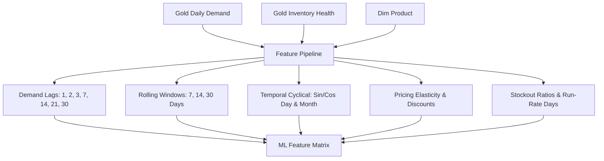

# Supply Chain Lakehouse — System Architecture

> Comprehensive architectural specification for the Supply Chain Lakehouse, ML Forecasting, Decision Intelligence, and MLOps Platform.

---

## 1. High-Level Architecture Overview

```text
[ Sources: ERP, WMS, POS, Logistics ]
                 │
                 ▼
     ┌───────────────────────┐
     │ Ingestion & Validation│ (Audit, Checksums, Schema Quarantine)
     └───────────┬───────────┘
                 │
                 ▼
  ┌───────────────────────────────┐
  │   MEDALLION LAKEHOUSE (S3)    │
  │  ├── Bronze: Raw Append Delta │
  │  ├── Silver: Cleaned & Typed  │
  │  └── Gold: Aggregated & Facts │
  └──────────────┬────────────────┘
                 │
                 ▼
  ┌───────────────────────────────┐
  │   FEATURE STORE PIPELINE      │ (Zero-Leakage Invariant, Lags, Rolling Windows)
  └──────────────┬────────────────┘
                 │
                 ▼
  ┌───────────────────────────────┐
  │   ML TRAINING & VALIDATION    │ (TimeSeriesSplit, Baselines, Regressors, WAPE/MAE)
  └──────────────┬────────────────┘
                 │
                 ▼
  ┌───────────────────────────────┐
  │   MLOPS & MODEL REGISTRY      │ (Champion vs Challenger Auto-Promotion Gate)
  └──────────────┬────────────────┘
                 │
                 ▼
  ┌───────────────────────────────┐
  │   DECISION INTELLIGENCE       │ (Dynamic Safety Stock, ROP, Order Quantities)
  └──────────────┬────────────────┘
                 │
                 ▼
  ┌───────────────────────────────┐
  │   ANALYTICS & MONITORING      │ (Streamlit Command Center, PSI Drift Detection)
  └───────────────────────────────┘
```

---

## 2. Medallion Data Engineering Flow

### Bronze Layer (`src/lakehouse/bronze`)
- Ingests transactional and master datasets directly from S3.
- Preserves raw schema, audit metadata (`ingestion_timestamp`, `batch_id`, `source_file`), and enforces idempotency via SHA256 checksums.

### Silver Layer (`src/lakehouse/silver`)
- Standardizes data types and schema contracts.
- Routes malformed records into quarantine tables.
- Applies deduplication and Delta `MERGE` upsert operations.

### Gold Layer (`src/lakehouse/gold`)
- **Dimensions**: `dim_product`, `dim_store`, `dim_supplier`.
- **Facts**: `fact_sales`, `fact_inventory`, `fact_shipments`.
- **Analytical Tables**: `gold_daily_demand`, `gold_inventory_health`, `gold_supplier_performance`.

---

## 3. Machine Learning & Feature Store (`src/features/`)



- **Zero Future Leakage Guarantee**: All rolling demand statistics are computed strictly on shifted observations ($Data \le D-1$).

---

## 4. MLOps Lifecycle & Model Registry (`src/training/`)

```text
Challenger Model Fit
       │
       ▼
Holdout Evaluation (Future 14 Days)
       │
       ▼
Champion vs Challenger Gate
       │
   ┌───┴───────────────────────────────┐
   │ Check 1: WAPE < Max Limit (50%)   │
   │ Check 2: Absolute Bias <= 15%     │
   │ Check 3: Improvement >= 5% vs Champ│
   └───┬───────────────────────────────┘
       │
   ┌───┴───────────────┐
   │                   │
[PASS]              [FAIL]
   │                   │
   ▼                   ▼
Promote to         Reject & Retain
PRODUCTION         Current Champion
(Archive Old)
```

---

## 5. Decision Intelligence & Inventory Replenishment (`src/inference/`)

1. **Dynamic Safety Stock Formula**:
   $$SS = Z \times \sqrt{L \cdot \sigma_d^2 + d^2 \cdot \sigma_L^2}$$
   Where $Z$ is the service level z-score ($1.645$ for $95\%$), $L$ is supplier lead time, and $d$ is forecasted daily demand.

2. **Reorder Point (ROP)**:
   $$ROP = (d \times L) + SS$$

3. **Urgency Classification**:
   - `CRITICAL`: Days of coverage $\le 3$ days.
   - `HIGH`: Days of coverage $\le$ Supplier Lead Time.
   - `MEDIUM`: Inventory below Reorder Point.
   - `HEALTHY`: Operating within normal safety parameters.
   - `OVERSTOCK`: Forward coverage $> 60$ days.

---

## 6. Continuous Monitoring & Automated Retraining (`src/monitoring/`)

- **Population Stability Index (PSI)**: Evaluates distribution shift per feature decile.
  - $PSI < 0.10$: Healthy / No Drift.
  - $0.10 \le PSI < 0.25$: Moderate Shift.
  - $PSI \ge 0.25$: Significant Drift $\to$ Triggers Retraining.
- **Model Health Evaluation**: Monitors live rolling WAPE and Forecast Bias against predefined warning and critical thresholds.
